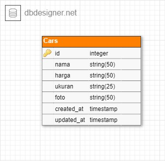

## Entity Relationship Diagram (ERD)
diagram yang sesuai dengan database yang digunakan


## Install Depedency
Install semua package node js
```
    # Pengguna NPM
    npm install
```
## Config Envy
buat file bernama .env dengan format sepertfi file .env-example

## Connect Database PG with Sequelize
Sambungkan Database PostgreSQL dengan perintah
```
    // membuat database di postgre pada file .env jika database di postgre belum di buat
    sequelize db:create
    sequelize db:migrate
    // Operasi Insert atau Delete data ke Postgre
    sequelize db:seed:all
```

## How To Run
Jalankan perintah berikut untuk menjalankan programnya
```
    npm run start
```
